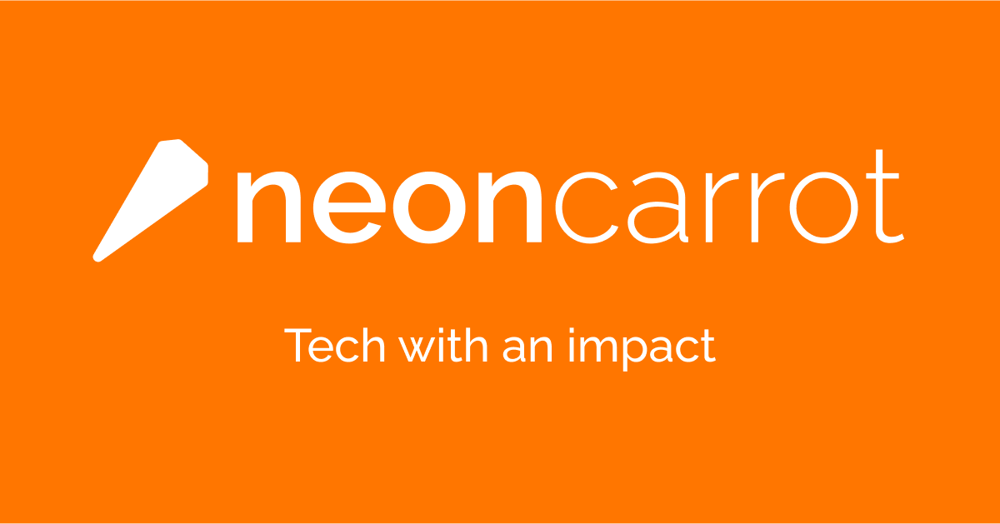

<a name="readme-top"></a>

[](https://app.netlify.com/sites/neoncarrot/deploys)

<div align="center">


<h1 align="center">Neon Carrot</h1>
  <p align="center">
    Neon Carrot is an IT consultancy dedicated to service not-for-profits.
    <br />
    <br />
    <a href="https://www.neoncarrot.com.au">View site</a>
    ·
    <a href="https://github.com/Caleb-Ellis/neoncarrot.com.au/issues/new">Report a bug</a>
  </p>
</div>

## Built with

- [](https://astro.build)
- [](https://www.typescriptlang.org/)

<p align="right">(<a href="#readme-top">back to top</a>)</p>

## Installation

1. Clone the repo
   ```sh
   git clone https://github.com/Neon-Carrot/neoncarrot.com.au.git
   ```
2. Install NPM packages
   ```sh
   npm install
   ```
3. Run locally
   ```sh
   npm run dev
   ```

<p align="right">(<a href="#readme-top">back to top</a>)</p>

<!-- LICENSE -->

## License

Distributed under the BSD-3-Clause "New" License. See [`LICENSE.txt`](./LICENSE.txt) for more information.

<p align="right">(<a href="#readme-top">back to top</a>)</p>

<!-- CONTACT -->

## Contact

- Caleb Ellis - [caleb@neoncarrot.com.au](mailto:caleb@neoncarrot.com.au)
- Carolina Fonseca [carol@neoncarrot.com.au](mailto:carol@neoncarrot.com.au)

<p align="right">(<a href="#readme-top">back to top</a>)</p>
